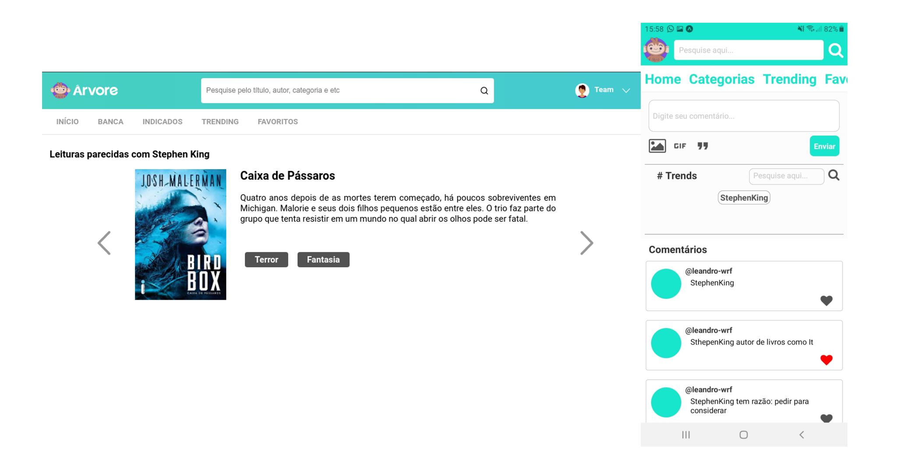

<h1 align="center" >🚀 Projeto Trending </h1>



<p align="center">
  

  
  
  
  

  
</p>

<h3>💻 Tecnologias utilizadas</h3>

<ul>
  <li>NodeJs</li>
  <li>Reactjs</li>
  <li>Expo</li>
  <li>PWA</li>
</ul>

<h3>✏ Como utilizar o projeto</h3>

```
 ### Clone este repostório

 git clone https://github.com/teamhackx6/trendingsarvore.git && cd trendingsarvore/

 ## Como colocar o projeto para rodar, antes você precisa ter certeza
 ## que contém a versão do nodejs 12.6 ou maior, instalada em sua máquina
 ## Caso não tenha a depêndencia, aqui está o link para poder instalart 

 https://nodejs.org/en/download/package-manager/

 ## Caso não queira utilizar o npm com packager manager
 ## aqui está o link para instalar o yarn package

 https://classic.yarnpkg.com/en/docs/install

 ## Agora vamos para o backend, suba as migrations do backend

 cd backend/ && yarn knex migrate:latest

 ## Agora você pode rodar o código

 yarn dev

 ## Logo após rodar o backend, você pode iniciar o frontend e mobile
 ## Vamos começar pelo frontend

 cd frontend/ && yarn start

 ## Agora é a vez do mobile, para este você necessita ter o expo instalado
 ## Caso não tenha, aqui está o link para poder instalar

 https://docs.expo.io/get-started/installation/

 # Agora vamos inicializar o app

 cd mobile/ && expo start 
```

<h3>🚀 Contribuidores</h3>
<p>Andre Ricardo: https://github.com/andrericardoweb</p>
<p>Edson Mello: https://github.com/andrericardoweb</p>
<p>Leandro Ferreira: https://github.com/andrericardoweb</p>